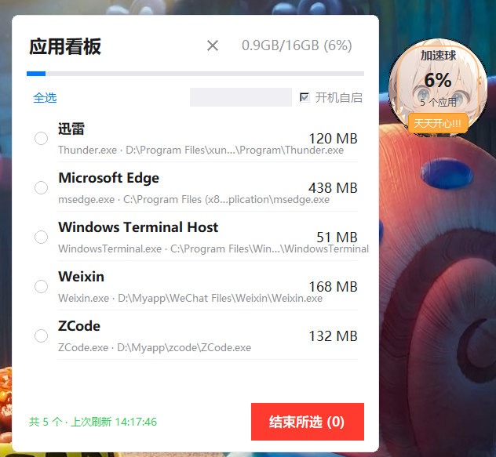

# Purify · Windows 进程清理悬浮球

> 当前版本 **v1.0.0**(2026-09-27)

仿 360 加速球的轻量 Windows 小工具:桌面角落常驻一个角色立绘小圆球,**左键点球**弹出看板,里面列出**你自己手动打开的应用进程**(微信、Codex、B站客户端……),系统进程一律过滤掉,勾选后**一键结束**。

## 界面预览

| 悬浮球 · 静止 | 悬浮球 · 悬停 | 应用看板 |
|:---:|:---:|:---:|
|  |  |  |

鼠标悬停小球,立绘会灵动地推近到脸部特写、数据盘淡出;移开恢复。点一下弹出看板。

## 功能特色

- 无需安装,单个 exe,双击即用
- 四层过滤只显示"你打开的应用":当前用户 → **只保留有可见窗口的进程**(关机会关闭的那批)→ 排除系统目录 → 排除系统组件黑名单
- 应用显示"人话名字"(读 exe 自带的文件说明,如 `Thunder.exe` → 迅雷)
- 扫描在后台线程进行,界面永不卡顿;面板收起时零渲染开销
- **防重复启动**、开机自启开关、两段式结束确认

## 下载

永久固定链接(永远指向最新版):

**https://github.com/wind-001/purify-assistant/releases/latest/download/Purify.exe**

## 使用方法

- **左键点悬浮球**:弹出 / 收起看板(点面板外面也会自动收起,Esc 同效)
- **按住拖动**:悬浮球可以拖到屏幕任意位置
- **鼠标悬停**:立绘推近脸部、数据盘淡出;移开恢复
- **右键悬浮球**:菜单里有"开机自启"开关和"退出"
- 看板里勾选进程(支持左上角**全选**)→ 点红色 **结束所选** → **再点一次确认**
- 球上大数字 = 看板应用内存占全局内存比例,小字 = 应用数量
- **防重复启动**:再次双击只会弹窗提醒,不会开出第二个球
- 个别进程"权限不足"时,右键 exe 选 **以管理员身份运行** 再杀

## 已知问题

- **杀毒软件 / SmartScreen 误报**:无签名的小众 exe 常见,选择"仍要运行"即可
- **列表只显示"有窗口"的应用**:托盘后台进程不单独出现(同任务管理器"应用"口径)
- **UWP 应用**路径可能显示不全,仍可正常结束
- 黑名单在 `scanner.py` 的 `SYSTEM_PROCESS_NAMES`,可自行调整

## 版本历史

- **v1.0.0**(2026-09-27):首个公开版本。立绘加速球(悬停推近脸部)、圆角看板、四层进程过滤、人话名字、一键全选、开机自启、防重复启动。

## License

[MIT](LICENSE)
